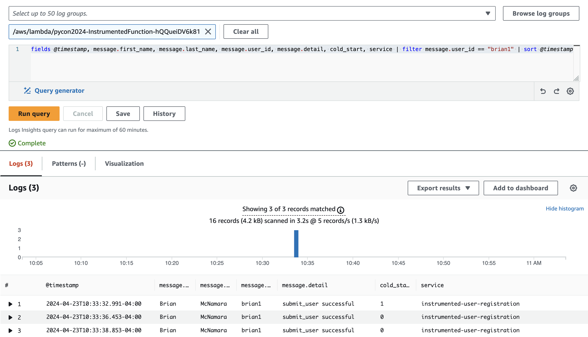

# Logging

The first observability signal we're going to examine is logging. Simply put, a log is a stream of ordered events. As developers, we can specify things we want to capture in this event stream to help us understand when things are going well and when they're not.

AWS Lambda has very tight integration with Amazon CloudWatch Logs. This mean that we don't need to specify a log destination akin to syslog in order to capture our logs centrally. Any output we send to standard output (STDOUT) is captured by CloudWatch Logs if our function's IAM permissions are set properly.

**NOTE:** AWS SAM will attach a default policy `AWSLambdaBasicExecutionRole` that allows for Lambda functions to write logs to CloudWatch Logs. Be aware that if you use Amazon CloudFormation or other Infrastructure as Code (IaC) tooling then you may need to attach a policy that allows your Lambda functions to log data properly.

## Logging - Vanilla Edition

The `VanillaFunction` Lambda function log entry captures basic information common to all Lambda functions as well as information that is being emitted via the `print()` function.

Let's invoke `VanillaFunction` in the AWS cloud with the following command:

```bash
make remote-vanilla
```

We can then view the output generated in our CloudWatch Logs with the `sam logs` command:

```bash
sam logs -n VanillaFunction --stack-name $CFN_STACK --start-time '5min ago' --region $AWS_REGION --profile $AWS_PROFILE 

2024/04/23/[$LATEST]235e802547a3435abb4fa7ef75c6f131 2024-04-23T12:18:57.752000 INIT_START Runtime Version: python:3.11.v33     Runtime Version ARN: arn:aws:lambda:us-east-1::runtime:66487d2b05f942253fabd37b0f90dacbef41d948451a312bd1dd107f7801aa81
2024/04/23/[$LATEST]235e802547a3435abb4fa7ef75c6f131 2024-04-23T12:18:58.360000 START RequestId: c611427c-e710-4481-a135-0e517fcaf85a Version: $LATEST
2024/04/23/[$LATEST]235e802547a3435abb4fa7ef75c6f131 2024-04-23T12:18:59.332000 [Success] Added user Brian McNamara (brian1): 200
2024/04/23/[$LATEST]235e802547a3435abb4fa7ef75c6f131 2024-04-23T12:18:59.336000 END RequestId: c611427c-e710-4481-a135-0e517fcaf85a
2024/04/23/[$LATEST]235e802547a3435abb4fa7ef75c6f131 2024-04-23T12:18:59.336000 REPORT RequestId: c611427c-e710-4481-a135-0e517fcaf85a  Duration: 973.92 ms     Billed Duration: 974 ms Memory Size: 256 MB        Max Memory Used: 94 MB  Init Duration: 606.54 ms
```

The output captures a lot of information about the invocation. The following default information is common to all Lambda logs:

* **INIT_START**: This line captures the runtime version and runtime version ARN.

* **START**: This line captures the Request ID along with the version of the executed function

* **END**: This line captures the Request ID and indicates the function execution is complete.

* **REPORT**: This line provides a summary of the function execution
    
    * **RequestId**: Unique invocation Request ID 
    
    * **Duration**: The amount of time the function's handler spent processing the event
    
    * **Billed Duration**: The amount of time billed billed for the invocation (nearest 1ms)
    
    * **Memory Size**: The amount of memory allocated to the function
    
    * **Max Memory Used**: The maximum amount of memory used by the function

    * **Init Duration**: The amount of time taken to load the function and run code outside of the handler function (ie cold start)

The application code is only emitting one log line, indicating a new user was added successfully:

```bash
[Success] Added user Brian McNamara (brian1): 200
```

### What's Not Great About the VanillaFunction Logs?

While the status of the operation is captured, it will likely be difficult to understand the application's behavior or troubleshoot problems. Humans may be able to read a log line clearly, but _searching_ becomes difficult. There is no structure to the application log.

Fortunately, we can improve upon this experience.

## Logging - Instrumented Edition

The `InstrumentedFunction` Lambda function log entry captures the same basic information common to all Lambda functions. However, we have changed the format of the application log entry to add additional context and structure.

Let's invoke `InstrumentedFunction` in the AWS cloud with the following command:

```bash
make remote-instrumented
```

We can then view the output generated in our CloudWatch Logs with the `sam logs` command:

```bash
sam logs -n InstrumentedFunction --stack-name $CFN_STACK --start-time '5min ago' --region $AWS_REGION --profile $AWS_PROFILE

2024/04/23/[$LATEST]aa01846ebbac447abcf20f17cb27c146 2024-04-23T13:26:03.078000 INIT_START Runtime Version: python:3.11.v33     Runtime Version ARN: arn:aws:lambda:us-east-1::runtime:66487d2b05f942253fabd37b0f90dacbef41d948451a312bd1dd107f7801aa81
2024/04/23/[$LATEST]aa01846ebbac447abcf20f17cb27c146 2024-04-23T13:26:03.800000 START RequestId: d683b1f7-ac35-4066-ae77-b6ab12a6fb32 Version: $LATEST
2024/04/23/[$LATEST]aa01846ebbac447abcf20f17cb27c146 2024-04-23T13:26:04.775000 {
  "level": "INFO",
  "location": "handler:62",
  "message": {
    "detail": "submit_user successful",
    "user_id": "brian1",
    "first_name": "Brian",
    "last_name": "McNamara",
    "email": "brian@mcnamara.com"
  },
  "timestamp": "2024-04-23 13:26:04,775+0000",
  "service": "instrumented-user-registration",
  "cold_start": true,
  "function_name": "pycon2024-InstrumentedFunction-hQQueiDV6k81",
  "function_memory_size": "256",
  "function_arn": "arn:aws:lambda:us-east-1:408023262302:function:pycon2024-InstrumentedFunction-hQQueiDV6k81",
  "function_request_id": "d683b1f7-ac35-4066-ae77-b6ab12a6fb32",
  "xray_trace_id": "1-6627b6ea-41da4c2b21729b794c0ba41a"
}
2024/04/23/[$LATEST]aa01846ebbac447abcf20f17cb27c146 2024-04-23T13:26:04.776000 {
  "_aws": {
    "Timestamp": 1713878764776,
    "CloudWatchMetrics": [
      {
        "Namespace": "Pycon2024",
        "Dimensions": [
          [
            "service"
          ]
        ],
        "Metrics": [
          {
            "Name": "SuccessfulSubmission",
            "Unit": "Count"
          }
        ]
      }
    ]
  },
  "service": "instrumented-user-registration",
  "SuccessfulSubmission": [
    1.0
  ]
}
2024/04/23/[$LATEST]aa01846ebbac447abcf20f17cb27c146 2024-04-23T13:26:04.780000 END RequestId: d683b1f7-ac35-4066-ae77-b6ab12a6fb32
2024/04/23/[$LATEST]aa01846ebbac447abcf20f17cb27c146 2024-04-23T13:26:04.780000 REPORT RequestId: d683b1f7-ac35-4066-ae77-b6ab12a6fb32  Duration: 978.56 ms     Billed Duration: 979 ms Memory Size: 256 MB        Max Memory Used: 95 MB  Init Duration: 720.71 ms
XRAY TraceId: 1-6627b6ea-41da4c2b21729b794c0ba41a       SegmentId: 776bf0746f88446c     Sampled: true
```

This output captures the common information (eg INIT_START, STARET, END, and REPORT) but it includes a _lot_ more information about the execution and includes it in a JSON format. Let's examine the application log output in particular and the mechanism we use to emit it.

### How Did We Do That?

Let's examine the structured application log output more closely.

```json
{
  "level": "INFO",
  "location": "handler:62",
  "message": {
    "detail": "submit_user successful",
    "user_id": "brian1",
    "first_name": "Brian",
    "last_name": "McNamara",
    "email": "brian@mcnamara.com"
  },
  "timestamp": "2024-04-23 13:26:04,775+0000",
  "service": "instrumented-user-registration",
  "cold_start": true,
  "function_name": "pycon2024-InstrumentedFunction-hQQueiDV6k81",
  "function_memory_size": "256",
  "function_arn": "arn:aws:lambda:us-east-1:408023262302:function:pycon2024-InstrumentedFunction-hQQueiDV6k81",
  "function_request_id": "d683b1f7-ac35-4066-ae77-b6ab12a6fb32",
  "xray_trace_id": "1-6627b6ea-41da4c2b21729b794c0ba41a"
}
```

We can see the same information we captured in our `VanillaFunction` output - we know the name, email, user_id, and status of the request - but we capture this information in a structured format. We are also able to capture relevant context about the execution itself in a structured format.

How did we capture this information?

In our example, we use the [Powertools for AWS Lambda (Python)](https://docs.powertools.aws.dev/lambda/python/latest/) module. It is an **extrememly** useful module that enables Lambda developers to take advantage of a number of capabilities, including observability. The actual line in our handler file [instrumented.py](./function/instrumented/instrumented.py#L62) emits data about our operation. By default it does so in a JSON format. By using the [@logger.inject_lambda_context decorator](./function/instrumented/instrumented.py#L62), we can add additional metadata about our function automatically.

What About the Logging Module?

It certainly is possible to use the `logging` module in the Python standard library - Powertools for AWS Lambda (Python) does this under the covers. However, it becomes more difficult to capture metadata about the function. In general, you should use Powertools for AWS Lambda (Python) for your logging needs.

### What Does Structured Logging Provide Us?

We know _how_ to create structured logs in our code. The question becomes - what value does structured logging provide us?

In short, structured logs are much simpler to query in tools like [Amazon CloudWatch Logs Insights](https://docs.aws.amazon.com/AmazonCloudWatch/latest/logs/AnalyzingLogData.html), [Splunk](https://www.splunk.com/), [Elastic](https://www.elastic.co/), and [Datadog](https://www.datadoghq.com/). Fields are automatically discovered and can be used in queries. If your log data is not structured, you must either write pre-processors to publish data to these log management solutions or write queries that utilize complex parsers to get at the data you need. Writing parsers is never fun - avoid it where possible.

Let's consider how we could query our logs generated by the `InstrumentedFunction` Lambda function. We can use Amazon CloudWatch Logs Insights to query all log entries that contain the `user_id` of `brian1` generated over the past 60 minutes.




<details>
<summary>Equivalent CLI command to query CloudWatch Logs Insights</summary>

**NOTE:** The `date` format used  the `QUERY_ID` work on Mac OS X. Using `date` on other operating systems may require changes to the `--start-time` and `--end-time`.

```bash
export INSTRUMENTED_FUNCTION=$(aws cloudformation describe-stacks \
--stack $CFN_STACK \
--query "Stacks[0].Outputs[0].OutputValue" \
--output text \
--region $AWS_REGION \
--profile $AWS_PROFILE)

export QUERY_ID=$(aws logs start-query \
 --log-group-name /aws/lambda/${INSTRUMENTED_FUNCTION} \
 --start-time $(date -v-60M "+%s") \
 --end-time $(date "+%s") \
 --query-string 'fields @timestamp, message.first_name, message.last_name, message.user_id, message.detail, cold_start, service | filter message.user_id == "brian1" | sort @timestamp' \
 --query "queryId" \
 --output text \
 --profile $AWS_PROFILE \
 --region $AWS_REGION)

sleep 5

aws logs get-query-results \
--query-id $QUERY_ID \
--output table \
--profile $AWS_PROFILE \
--region $AWS_REGION

--------------------------------------------------------------------------------------------------------------------------------------------------------------------------------------------------------------------------
|                                                                                                     GetQueryResults                                                                                                    |
+-------------------------------------------------------------------------------------------------+----------------------------------------------------------------------------------------------------------------------+
|  status                                                                                         |  Complete                                                                                                            |
+-------------------------------------------------------------------------------------------------+----------------------------------------------------------------------------------------------------------------------+
||                                                                                                        results                                                                                                       ||
|+--------------------+-------------------------------------------------------------------------------------------------------------------------------------------------------------------------------------------------+|
||        field       |                                                                                              value                                                                                              ||
|+--------------------+-------------------------------------------------------------------------------------------------------------------------------------------------------------------------------------------------+|
||  @timestamp        |  2024-04-23 14:33:32.991                                                                                                                                                                        ||
||  message.first_name|  Brian                                                                                                                                                                                          ||
||  message.last_name |  McNamara                                                                                                                                                                                       ||
||  message.user_id   |  brian1                                                                                                                                                                                         ||
||  message.detail    |  submit_user successful                                                                                                                                                                         ||
||  cold_start        |  1                                                                                                                                                                                              ||
||  service           |  instrumented-user-registration                                                                                                                                                                 ||
||  @ptr              |  CoUBCkgKRDQwODAyMzI2MjMwMjovYXdzL2xhbWJkYS9weWNvbjIwMjQtSW5zdHJ1bWVudGVkRnVuY3Rpb24taFFRdWVpRFY2azgxEAASNRoYAgZhLpQJAAAAAGJvrdwABmJ8atAAAAOSIAEo+ZaB2/AxMKfSgdvwMTgQQLohSMcpUIgaGAAgARACGAE=   ||
||  @timestamp        |  2024-04-23 14:33:36.453                                                                                                                                                                        ||
||  message.first_name|  Brian                                                                                                                                                                                          ||
||  message.last_name |  McNamara                                                                                                                                                                                       ||
||  message.user_id   |  brian1                                                                                                                                                                                         ||
--------------------------------------------------------------------------------------------------------------------------------------------------------------------------------------------------------------------------
|                                                                                                     GetQueryResults                                                                                                    |
+-------------------------------------------------------------------------------------------------+----------------------------------------------------------------------------------------------------------------------+
|  status                                                                                         |  Complete                                                                                                            |
+-------------------------------------------------------------------------------------------------+----------------------------------------------------------------------------------------------------------------------+
||  message.detail    |  submit_user successful                                                                                                                                                                         ||
||  cold_start        |  0                                                                                                                                                                                              ||
||  service           |  instrumented-user-registration                                                                                                                                                                 ||
||  @ptr              |  CoUBCkgKRDQwODAyMzI2MjMwMjovYXdzL2xhbWJkYS9weWNvbjIwMjQtSW5zdHJ1bWVudGVkRnVuY3Rpb24taFFRdWVpRFY2azgxEAASNRoYAgZhLpQJAAAAAGJvrdwABmJ8atAAAAOSIAEo+ZaB2/AxMKfSgdvwMTgQQLohSMcpUIgaGAAgARAHGAE=   ||
||  @timestamp        |  2024-04-23 14:33:38.853                                                                                                                                                                        ||
||  message.first_name|  Brian                                                                                                                                                                                          ||
||  message.last_name |  McNamara                                                                                                                                                                                       ||
||  message.user_id   |  brian1                                                                                                                                                                                         ||
||  message.detail    |  submit_user successful                                                                                                                                                                         ||
||  cold_start        |  0                                                                                                                                                                                              ||
||  service           |  instrumented-user-registration                                                                                                                                                                 ||
||  @ptr              |  CoUBCkgKRDQwODAyMzI2MjMwMjovYXdzL2xhbWJkYS9weWNvbjIwMjQtSW5zdHJ1bWVudGVkRnVuY3Rpb24taFFRdWVpRFY2azgxEAASNRoYAgZhLpQJAAAAAGJvrdwABmJ8atAAAAOSIAEo+ZaB2/AxMKfSgdvwMTgQQLohSMcpUIgaGAAgARAMGAE=   ||
|+--------------------+-------------------------------------------------------------------------------------------------------------------------------------------------------------------------------------------------+|
||                                                                                                      statistics                                                                                                      ||
|+----------------------------------------------------------------+--------------------------------------------------------------------------+--------------------------------------------------------------------------+|
||                          bytesScanned                          |                             recordsMatched                               |                             recordsScanned                               ||
|+----------------------------------------------------------------+--------------------------------------------------------------------------+--------------------------------------------------------------------------+|
||  4282.0                                                        |  3.0                                                                     |  16.0                                                                    ||
|+----------------------------------------------------------------+--------------------------------------------------------------------------+--------------------------------------------------------------------------+|
```
</details>


The important thing to note is it is easier to query and project structured log data.

## Summary

In short, make sure your Lambda functions emit log output in a structured format. You can take advantage of the Python standard library but you should strongly consider using [Powertools for AWS Lambda (Python)](https://docs.powertools.aws.dev/lambda/python/latest/) - you'll receive the benefit of structured logs and additional Lambda context without removing focus from developing your function code.

## What's Next?

Now that we've reviewed how to emit structured log data and its importance when querying, let's examine [**metrics**](./README-METRICS.md) in AWS Lambda functions.

