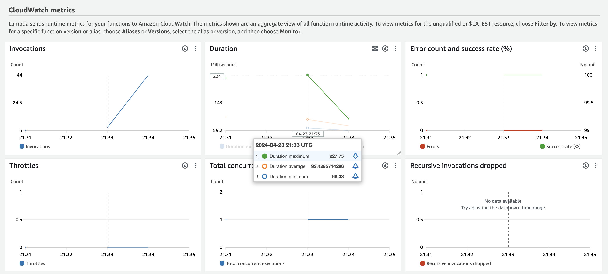
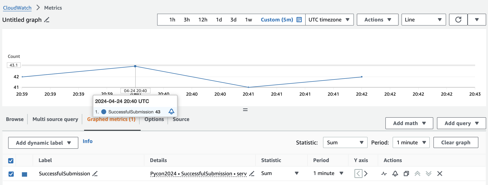

# Metrics

The next observability signal we're going to examine is metrics. Metrics are a numeric representation of data measured over time intervals. Metrics are useful for monitoring performance or recognizing whether events have occurred. They're not particulary useful on their own when troubleshooting issues.

AWS Lambda has very tight integration with Amazon CloudWatch Metrics. Even if we don't emit numeric values from our functions, the Lambda service will still publish metrics. There are 4 classes of metrics, each with multiple metrics.

* **Invocation** metrics: Binary indicators of the _outcome_ of an invocation

* **Performance** metrics: _Performance_ details of an invocation

* **Concurrency** metrics: _Aggregate count of instances_ processing events

* **Asynchronous invocation** metrics: Provide details about _asynchronous_ invocations from event sources and direct invocation

It is important to apply the correct statistic to a given metric.

| Metric Type  | Statistic |
|:------------:|:---------:|
| Invocation   | Sum       |
| Performance  | Average / Max / Percentile Stats |
| Concurrency  | Max       |
| Asynchronous | Sum       |

## Understanding Critical Lambda Metrics

There are a number of important default Lambda metrics that you should understand as a developer and operator:

**Invocations**: Invocations track the number of requests that are handled by your Lambda function. The metric provides a general sense of how busy your function is and whether there is a discernable pattern you can use to determine whether function auto-scaling may make sense. A function that is not being invoked may indicate a problem with its upstream source.

**Duration**: Duration tracks the amount of time each request takes. Duration has an impact on cost and consumed concurrency. If you see a horizontal line at the configuration duration maximum it's likely your function is experiencing timeouts.

**Errors**: Errors tracks number of errors thrown by a function. The amount of errors can be used by AWS to determine how much concurrency to drive to a function triggered asynchronously. The quantity of errors may not be a valuable figure on its own, but you can perform [metric math](https://docs.aws.amazon.com/AmazonCloudWatch/latest/monitoring/using-metric-math.html) to determine the error _rate_ and perhaps alarm accordingly.

**Throttles**: Throttles track the number of requests that could not be invoked because of insufficient available concurrency. There are a few likely causes of throttling. There may have been an unexpected spike in function invocations. There may be other functions in the same account and region that experienced a similar unexpected spike in function invocations. Perhaps the function has been configured with [reserved concurrency](https://docs.aws.amazon.com/lambda/latest/dg/configuration-concurrency.html) and could not scale. Maybe there are lot of functions deployed to an account. It's important to understand when throttles occur and investigate. You can set an appropriate Reserved Concurrency configuration on critical functions. You  can also [request a service quota increase from AWS](https://docs.aws.amazon.com/servicequotas/latest/userguide/request-quota-increase.html).

**DeadLetterErrors**: AWS Lambda functions can be triggered asynchronously via service like [Amazon S3](https://aws.amazon.com/s3) or [Amazon Simple Notification Service (SNS)](https://aws.amazon.com/sns/), A Lambda function invoked asyncronously may fail. The function can be configured to send an event to a [dead-letter queue (DLQ)](https://docs.aws.amazon.com/lambda/latest/dg/invocation-async.html#invocation-dlq) for further investigation or processing. If AWS Lambda cannot write to the designated dead-letter queue it will emit a DeadLetterErrors metric. You should alarm on any non-zero values for this metric.

**IteratorAge**: This value applies to Lambda functions that are configured with an [event source mapping](https://docs.aws.amazon.com/lambda/latest/dg/invocation-eventsourcemapping.html). An event source mapping reads from an event source and triggers a Lambda function. Lambda integrations with [Amazon Simple Queue Service (SQS)](https://docs.aws.amazon.com/lambda/latest/dg/with-sqs.html), [Amazon DynamoDB](https://docs.aws.amazon.com/lambda/latest/dg/with-ddb.html), and [Amazon Kinesis](https://docs.aws.amazon.com/lambda/latest/dg/with-kinesis.html) are examples. This Lambda metric indicates the age of the last record in the event. This metric measures the time between when a stream receives the record and when the event source mapping sends the event to the function. If you see the iterator age increasing it means your Lambda function cannot keep up with the volume of data being generated.

**ConcurrentExecutions**: This metric captures the number of executions that are simultaneously being handled. There is a fixed quota available to all functions in a given region and account. You can decrease consumed concurrency by reducing the duration of your functions. This value can be monitored at the function and region scope.

There are other function metrics but these few are really important to keep an eye on. With this background out of the way, let's return our focus to our sample functions.

## Metrics - Vanilla Edition

The `VanillaFunction` Lambda function emits default metrics. Because the function is invoked synchronously, there will be no associated asynchronous invocation metrics.

Let's invoke `VanillaFunction` in the AWS cloud with the following command:

```bash
make remote-vanilla
```

### What's Not Great About the VanillaFunction Metrics?

There is nothing inherently wrong about the metrics that are collected by CloudWatch Metrics. They allow us to view invocations, errors, and performance data. For application operators needing to understand Lambda function behavior, this is likely sufficient.



However, our function is not emitting business-specific metrics. It is likely our application has business stakeholders who want to understand the business value being driven by our function. Fortunately, we can add this capability easily.

## Metrics - Instrumented Edition

The `InstrumentedFunction` Lambda function emits a custom metric, relevant to our fictional user registration system. Business users have a need to understand when user registrations are successful and when they fail.

Let's invoke `InstrumentedFunction` in the AWS cloud with the following command:

```bash
make remote-instrumented
```

We can then view the output generated in the CloudWatch Metrics console:



### How Did We Do That?

Developers can publish custom metrics asynchronously to CloudWatch Logs using a defined schema - [Embedded Metrics Format (EMF)](https://docs.aws.amazon.com/AmazonCloudWatch/latest/monitoring/CloudWatch_Embedded_Metric_Format_Specification.html). Logs that conform to the EMF schema are published automatically to CloudWatch Metrics. While metrics can be published to CloudWatch Metrics using the [boto3](https://boto3.amazonaws.com/v1/documentation/api/latest/reference/services/cloudwatch/client/put_metric_data.html) module, fight the urge. The `put_metric_data` method is synchronous in nature. Any latency or errors publishing to CloudWatch Metrics will result in latency for your users and higher costs in both function execution and CloudWatch API calls. There is no extra cost to use EMF beyond log storage.

How did we capture this information?

In our example, we again use the [Powertools for AWS Lambda (Python)](https://docs.powertools.aws.dev/lambda/python/latest/) module. If the HTTP response is a `200` in our `submit_user` function then [instrumented.py](./function/instrumented/instrumented.py#L43) will add 1 to `SuccessfulSubmission`. If the HTTP response is not a `200` then [instrumented.py](./function/instrumented/instrumented.py#L45) will add 1 to `UnsuccessfulSubmission`.

Could We Use AWS' EMF Python Module?

Absolutely! The [aws-embedded-metrics module](https://github.com/awslabs/aws-embedded-metrics-python) is available for use and allows developers to publish metrics using EMF. However, Powertools for AWS Lambda (Python) makes this really easy. In general, you should use Powertools for AWS Lambda (Python) for your custom metrics needs.

## Summary

Make sure your Lambda functions emit metric data that helps provide the maximum insight for operators as well as business stakeholders. Make sure to custom metrics using the Embedded Metrics Format (EMF) to remove custom metrics from the function execution path. You can take advantage of the Python standard library, or even the [aws-embedded-metrics module](https://github.com/awslabs/aws-embedded-metrics-python), but you should strongly consider using [Powertools for AWS Lambda (Python)](https://docs.powertools.aws.dev/lambda/python/latest/) - you'll receive the ability to easily publish metrics asynchronously without removing focus from developing your function code.

## What's Next?

Now that we've reviewed  log data and its importance when querying, let's examine [**traces**](./README-TRACES.md) in AWS Lambda functions.
