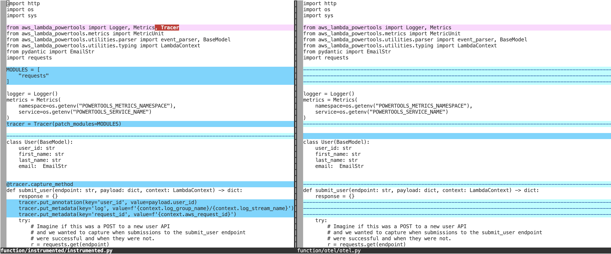
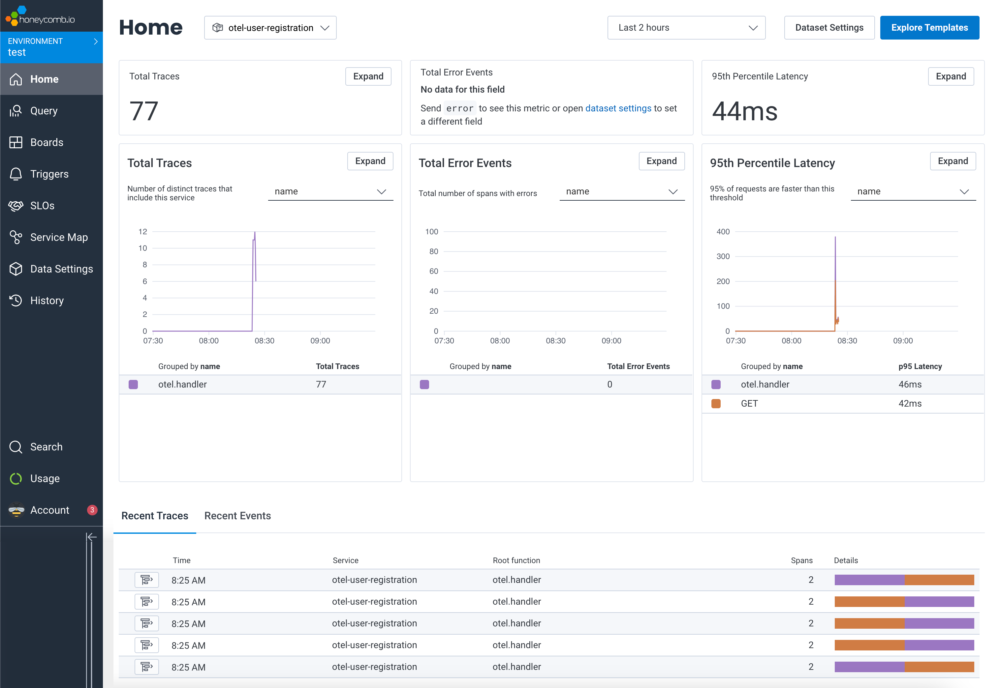
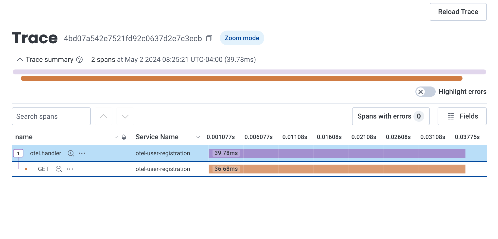
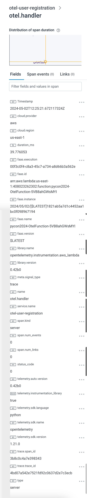
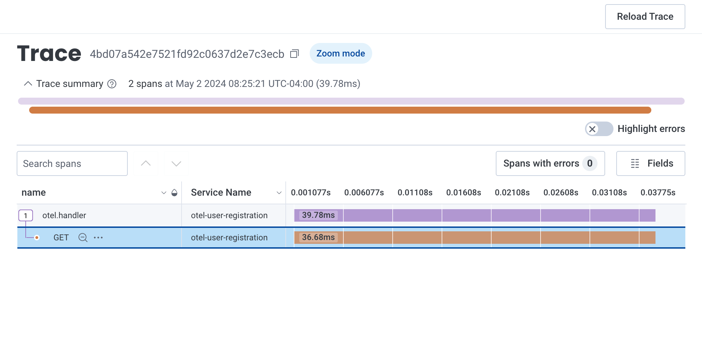
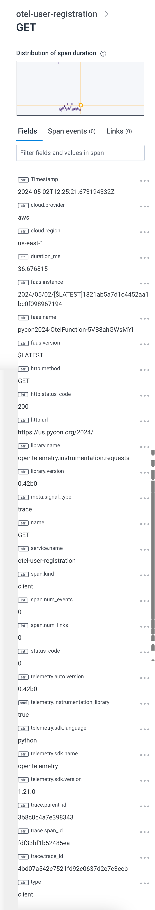
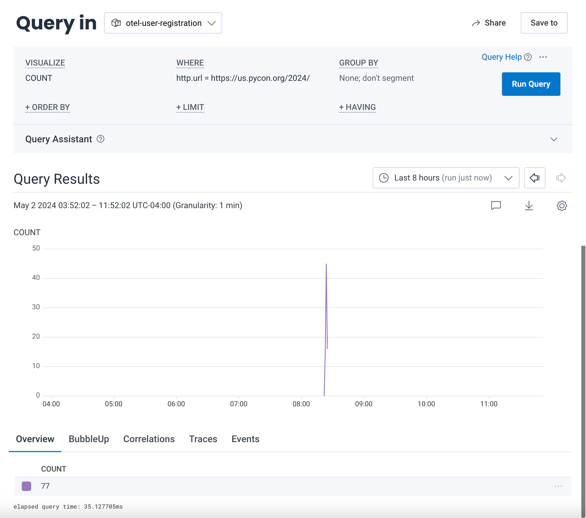
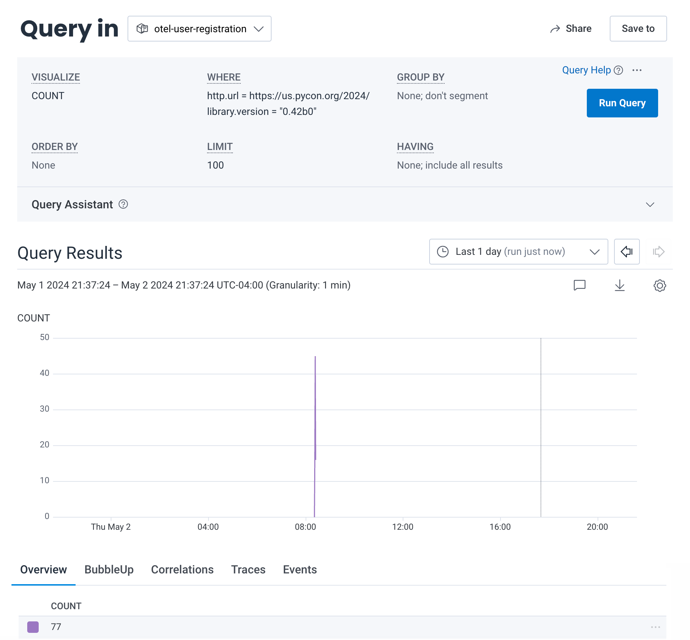

# OpenTelemetry (OTEL)

[OpenTelemetry (OTEL)](https://opentelemetry.io/) is an observability framework used to create and manage telemetry signals like logs, metrics, and traces. It is both vendor- and tool-agnostic; it will work with supported open source and commercial back-ends.

OTEL is a [Cloud Native Computing Foundation (CNCF)](https://landscape.cncf.io/?item=observability-and-analysis--observability--opentelemetry) project that was created through the merger of [OpenTracing and OpenCensus in 2019](https://www.cncf.io/blog/2019/05/21/a-brief-history-of-opentelemetry-so-far/).

There are several terms that should be defined before their usage:

* **Signals** are system outputs that describe the underlying activity of the operating system and application running on a platform. It can be something you want to measure at a point in time or an event that goes through a component. OTEL supports [traces](https://opentelemetry.io/docs/concepts/signals/traces), [metrics](https://opentelemetry.io/docs/concepts/signals/metrics), [logs](https://opentelemetry.io/docs/concepts/signals/logs), and [baggage](https://opentelemetry.io/docs/concepts/signals/baggage).

* **Instrumentation** is the process of emitting signals from a system's components. Instrumentation can occur through APIs but there are zero-code solutions.

* **Collector** is a way to receive, process, and export telemetry data to a back-end.

With these terms defined, let's look at how we're going to instrument our `OtelFunction` to send traces to Honeycomb using zero-code instrumentation through the use of the [AWS Distro for OpenTelemetry Lambda (ADOT)](https://aws-otel.github.io/docs/getting-started/lambda) layer.

**NOTE:** This example uses [Honeycomb](https://honeycomb.io) as the OTEL back-end for `OtelFunction`. You will have need to have already signed up for a free trial and set the [`HONEYCOMB_SECRET_ARN` value](https://github.com/mcnamarabrian/pycon2024/blob/main/README.md#sign-up-for-a-honeycomb-trial).

## OTEL in OtelFunction

The `OtelFunction` Lambda function's code is almost an exact copy of the `InstrumentedFunction` we've covered when discussing other observability signals. The only differences are the absence of the `Tracer` module and the associated X-Ray tracing decorators and wrappers.



Let's invoke `OtelFunction` in the AWS cloud with the following command:

```bash
make remote-otel
```

Our Amazon CloudWatch Logs output and CloudWatch Metrics output should look familiar - it's similar to what we've seen when invoking `InstrumentedFunction`. However, our traces are not being sent to AWS X-Ray. Instead, they are being sent to [Honeycomb](https://honeycomb.io). Let's take a look at the generated data.


_Honeycomb Home Page_

We can browse traces for the given time period to get more detail.

## Browsing Traces in Honeycomb

<details>
<summary>otel-user-registration Service - otel.handler Summary</summary>



</details>

<details>
<summary>otel-user-registration Service - otel.handler Detail</summary>



</details>

<details>
<summary>otel-user-registration Service - GET Summary</summary>



</details>

<details>
<summary>otel-user-registration Service - GET Detail</summary>



</details>

## Searching Traces in Honeycomb

Similar to AWS X-Ray, we can search through our traces to get more insight into what our function is doing.

<details>
<summary>Search - http.url</summary>



</details>

<details>
<summary>Search - http.url and library.version</summary>



</details>

### How Did We Do That?

Our code has not been instrumented with the Python OTEL SDK so how did the trace data make it to Honeycomb? 

_The [AWS Distro for OpenTelemetry Lambda (ADOT)](https://aws-otel.github.io/docs/getting-started/lambda) layer!_

There are a few addition items to consider but the capability to use zero-code instrumentation begins with the capabilities baked into the layer. The layer includes both OpenTelemetry SDK and the ADOT Collector components. Configuration values for the collector are defined both as [environment variables in the template.yaml](./template.yaml#L139) file and the [otel-config.yaml](./function/otel/otel-config.yaml) files. In our example, we are storing the Honeycomb API Key and Honeycomb API endpoint as environment variables stored in [AWS Secrets Manager](https://aws.amazon.com/secrets-manager/).

We could take our OTEL instrumentation a bit further by adding metrics and detailed traces; as of May 2024 the logging signal is not yet supported in the [Python SDK](https://opentelemetry.io/docs/languages/python/).

**NOTE**: Lambda layers may consume additional resources in your execution environments. Make sure you understand the optimal memory setting for your function _before_ deploying code to production. Explore [AWS Lambda Power Tuning](https://docs.aws.amazon.com/lambda/latest/operatorguide/profile-functions.html) to identify the proper memory setting.

## Summary

You should feel comfortable with using OTEL if you or your organization are embracing the observability standard. AWS is very engaged with the OTEL community. Stay tuned for developments in the space.

## What's Next?

We've covered a _lot_ of ground. We'll summarize the important points and share resources that may help you on your quest for optimal AWS Lambda observability.
