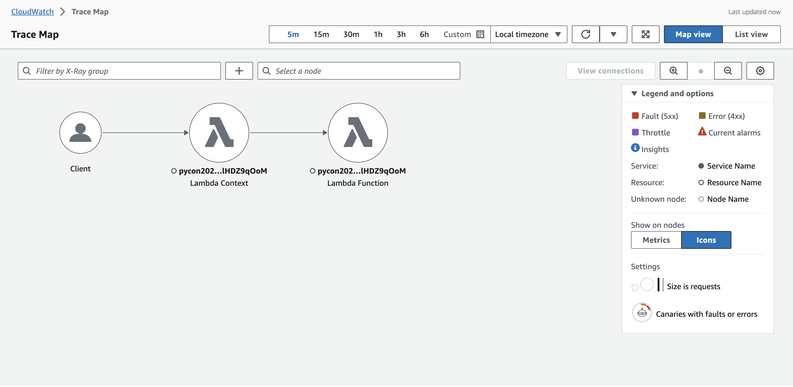
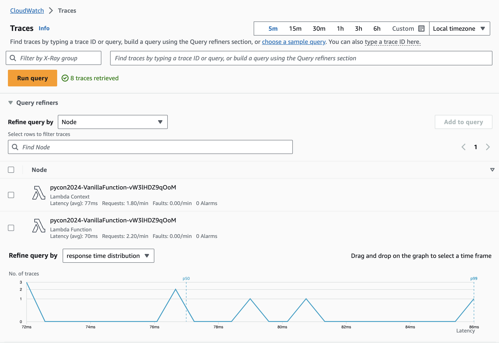
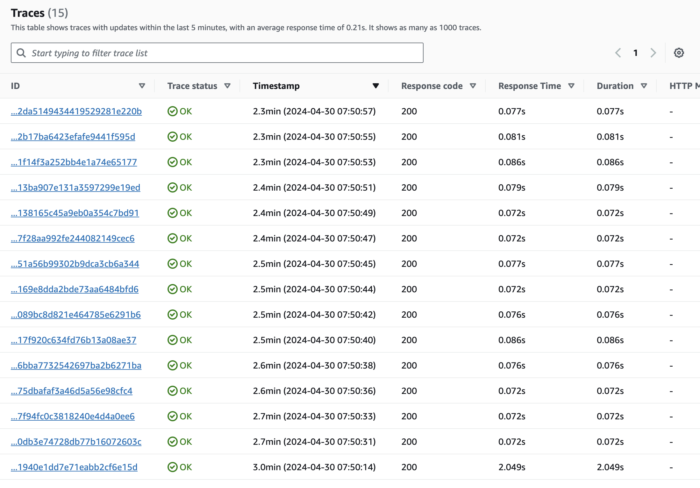
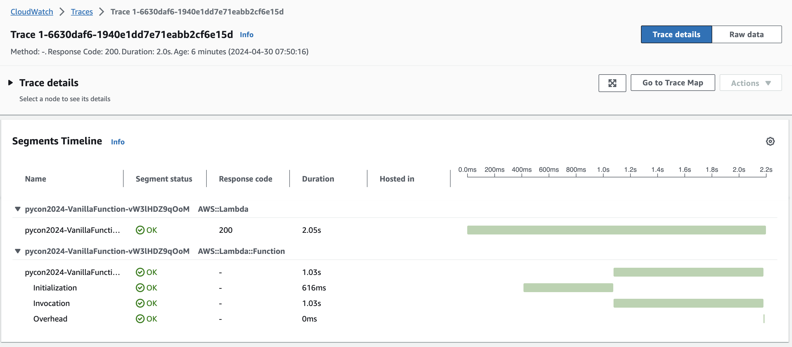
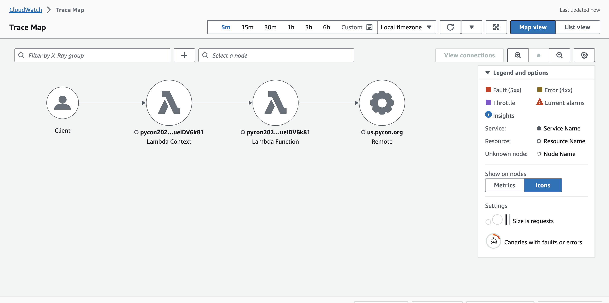
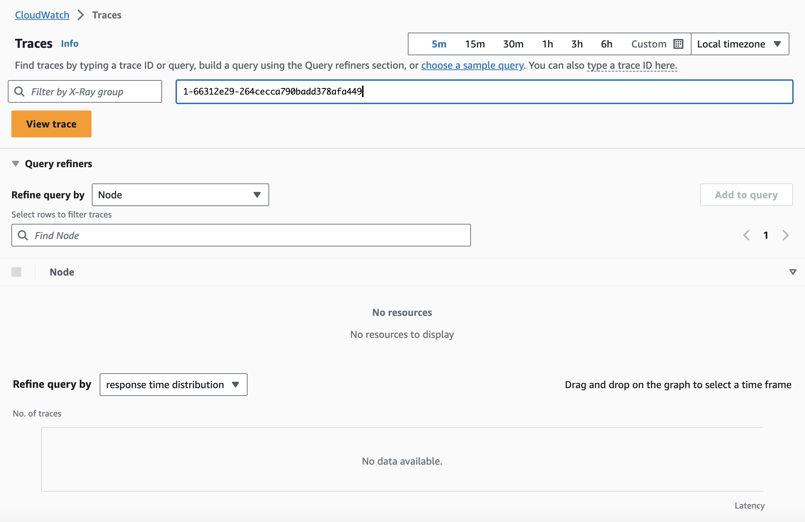
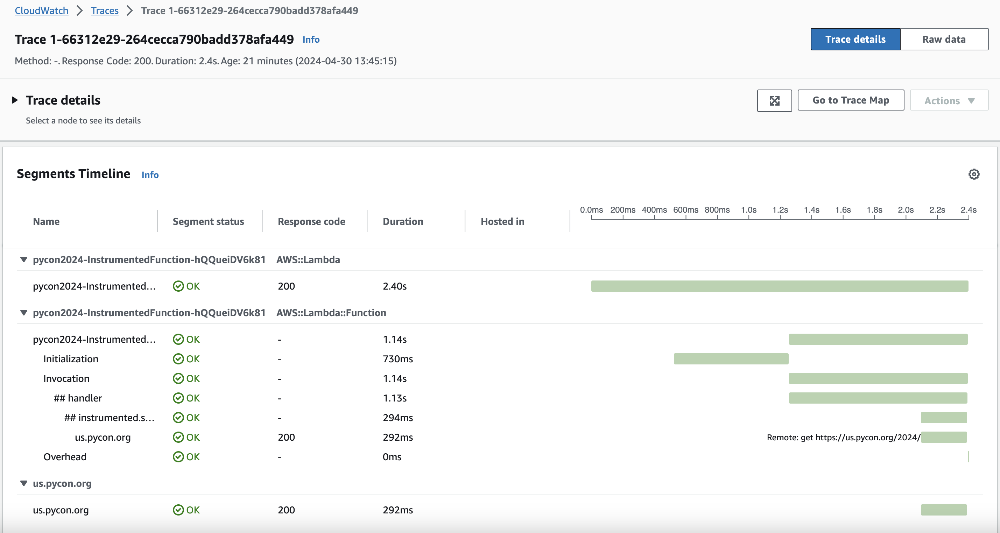
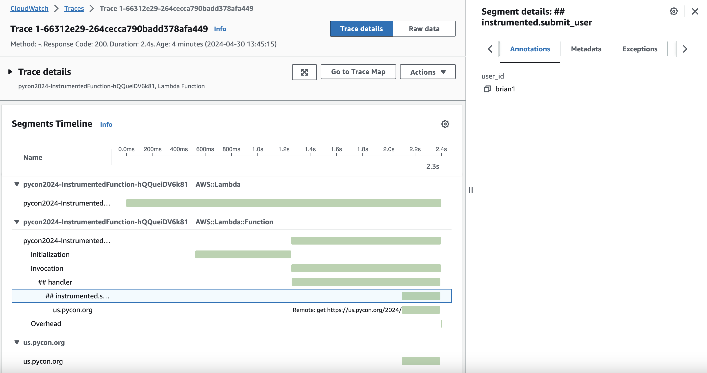
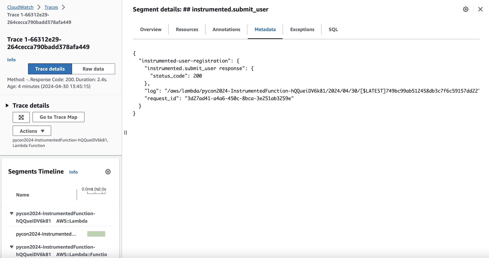

# Traces

The final observability signal we're going to examine is distributed tracing. Tracing is a valuable concept that allows to to gain insight into performance of all components in a microservice. Where logging and metrics context focuses on a local component, tracing is concerned with what happens __beyond__ the function boundary.

AWS Lambda has very tight integration with [AWS X-Ray](https://aws.amazon.com/xray). AWS assumes the operational burden of running a daemon to catpure trace information on your behalf. Several AWS services, including AWS Lambda, can create new traces, allowing downstream resources to add additional data (ie spans). This capability allows X-Ray to present an end-to-end view of components involved in applications.

**NOTE:** Your function's execution role must have sufficient IAM permissions to send data to X-Ray. There is a default policy (AWSXRayDaemonWriteAccess](https://console.aws.amazon.com/iam/home#/policies/arn:aws:iam::aws:policy/AWSXRayDaemonWriteAccess)) that can be used. Alternately, you can write a policy like the one we have in our application for each function. (eg [VanillaFunction X-Ray policy](./template.yaml#L67)).

## Traces - Vanilla Edition

The `VanillaFunction` Lambda function has `Active` tracing enabled. This means that a new trace header, including the ID, will be added and sent to downstream services in subsequent requests.

Let's invoke `VanillaFunction` in the AWS cloud with the following command:

```bash
make remote-vanilla
```

The command will emit the typical log output we've seen but I'd like to call out one line in particular:

```bash
START RequestId: 70b4cbee-8cac-4b3d-b719-d5ece1bf6940 Version: $LATEST
[Success] Added user Brian McNamara (brian1): 200
END RequestId: 70b4cbee-8cac-4b3d-b719-d5ece1bf6940
REPORT RequestId: 70b4cbee-8cac-4b3d-b719-d5ece1bf6940  Duration: 1028.49 ms    Billed Duration: 1029 ms        Memory Size: 256 MB     Max Memory Used: 93 MB  Init Duration: 615.62 ms        
XRAY TraceId: 1-6630daf6-1940e1dd7e71eabb2cf6e15d       SegmentId: 602bd33a7480db5a     Sampled: true   
{"status_code": 200, "user_id": "brian1", "first_name": "Brian", "last_name": "McNamara", "email": "brian@mcnamara.com"}
```

There is a `XRAY TraceId`, `SegmentId`, and `Sampled` key. This lets us know that a trace has been created and the request has been sampled.

We can then view the output generated in the AWS Console. Below is sample data available to our function.


_Service Map_



_Trace Summary_


_Trace Detail_

Keep in mind the code itself has not been annotated. This is the out-of-the-box experience when using AWS X-Ray with AWS Lambda functions. Similar to our logs and metrics experience - it's good, but could be made better.

### What's Not Great About the VanillaFunction Logs?

This is the out-of-the-box experience when using AWS X-Ray with AWS Lambda functions. We have a sense of the AWS services our Lambda function interacts with. We get a However, we don't have a lot of visibility into what is actually happening inside of our functions, or whether there are any non-AWS services that interact with our Lambda function.

Fortunately, we can improve upon this experience.

## Traces - Instrumented Edition

The `InstrumentedFunction` Lambda function is configured to capture X-Ray traces. However, we have changed the code to emit more contextual information about the traced code.

Let's invoke `InstrumentedFunction` in the AWS cloud with the following command:

```bash
make remote-instrumented
```

Similar to our earlier invocation of the `VanillaFunction`, we see this invocation generates `XRAY TraceId`, `SegmentId`, and `Sampled` key.

```bash
[*] Invoking InstrumentedFunction in AWS
sam remote invoke --event-file ./events/valid_user.json InstrumentedFunction --stack-name $CFN_STACK --profile $AWS_PROFILE --region $AWS_REGION
Invoking Lambda Function InstrumentedFunction                                                                                              
START RequestId: 3d27ad41-a4a6-450c-8bca-3e251ab3259e Version: $LATEST
{"level":"INFO","location":"handler:62","message":{"detail":"submit_user successful","user_id":"brian1","first_name":"Brian","last_name":"McNamara","email":"brian@mcnamara.com"},"timestamp":"2024-04-30 17:45:15,695+0000","service":"instrumented-user-registration","cold_start":true,"function_name":"pycon2024-InstrumentedFunction-hQQueiDV6k81","function_memory_size":"256","function_arn":"arn:aws:lambda:us-east-1:408023262302:function:pycon2024-InstrumentedFunction-hQQueiDV6k81","function_request_id":"3d27ad41-a4a6-450c-8bca-3e251ab3259e","xray_trace_id":"1-66312e29-264cecca790badd378afa449"}
{"_aws":{"Timestamp":1714499115695,"CloudWatchMetrics":[{"Namespace":"Pycon2024","Dimensions":[["service"]],"Metrics":[{"Name":"SuccessfulSubmission","Unit":"Count"}]}]},"service":"instrumented-user-registration","SuccessfulSubmission":[1.0]}
END RequestId: 3d27ad41-a4a6-450c-8bca-3e251ab3259e
REPORT RequestId: 3d27ad41-a4a6-450c-8bca-3e251ab3259e  Duration: 1137.02 ms    Billed Duration: 1138 ms        Memory Size: 256 MB     Max Memory Used: 94 MB  Init Duration: 729.86 ms        
XRAY TraceId: 1-66312e29-264cecca790badd378afa449       SegmentId: 29b2db393960f3d1     Sampled: true   
{"status_code": 200, "user_id": "brian1", "first_name": "Brian", "last_name": "McNamara", "email": "brian@mcnamara.com"}
```

However, the `InstrumentedFunction` trace has some extra details.


_Service Map_

We can use a simple search to view the generated `TraceId`.


_Simple Search by TraceId_


_Overview of a Single Trace_

Notice the `Invocation` phase is broken down further into composite parts. The `handler` and `submit_user` functions are broken out, allowing us to see the duration at a more granular level. In addition, we've enriched our traces to include **annotations** and **metadata**. Both function similarly - they offer a mechanism to add additional key/value data pairs to traces.


_Trace Annotation_

 Annotations are indexed and can be used in trace queries. Trace metadata is not indexed and cannot be used in searches.

 
_Trace Metadata_

Here is an example of how we can use annotations when searching through traces.


### How Did We Do That?

We've enriched our `InstrumentedFunction` code throughout and are making use of the `Tracer` feature from [Powertools for AWS Lambda](https://docs.powertools.aws.dev/lambda/python/latest/). `Tracer` is an opinionated thin wrapper for the [AWS X-Ray Python SDK](https://github.com/aws/aws-xray-sdk-python/). As such, many of its capabilities are exposed.

We use native capabilities exposed by the X-Ray SDK to patch supported libraries. In our example, we are only patching the [requests module](./function/instrumented/instrumented.py#L21) but there are others that could be patched. The full list can be referenced in the [AWS documentation](https://docs.aws.amazon.com/xray/latest/devguide/xray-sdk-python-patching.html).

We use the [`capture_lambda_handler`](./function/instrumented/instrumented.py#L52) decorator to add `ColdStart` and `Service` annotations. These values can be searched in our traces. We also trace the [`submit_user`](./function/instrumented/instrumented.py#L31) function through the use of the `capture_method` decorator. We're also adding our [annotation](./function/instrumented/instrumented.py#L33) and [additional metadata](./function/instrumented/instrumented.py#L34).

## Summary

Traces give you insight into what is happening outside the boundary of your function. There is a lot of win to be had just by enabling [Active tracing](./template.yaml#L48) in your Lambda functions. There is even more win to be had by instrumenting your code. You can make your trace data as robust as needed to better understand the workings of your code. Even though [traces are sampled](https://docs.aws.amazon.com/lambda/latest/dg/services-xray.html) they are a valuable observability tool.

## What's Next?

Up to this point we've focused our Lambda observability discussion in the context of AWS-provided services like [Amazon CloudWatch](https://aws.amazon.com/cloudwatch/) and [AWS X-Ray](https://aws.amazon.com/xray/).

In the next section, we're going to look at how we can use [OpenTelemetry (OTEL)](./README-OTEL.md) to observe our Lambda application.
